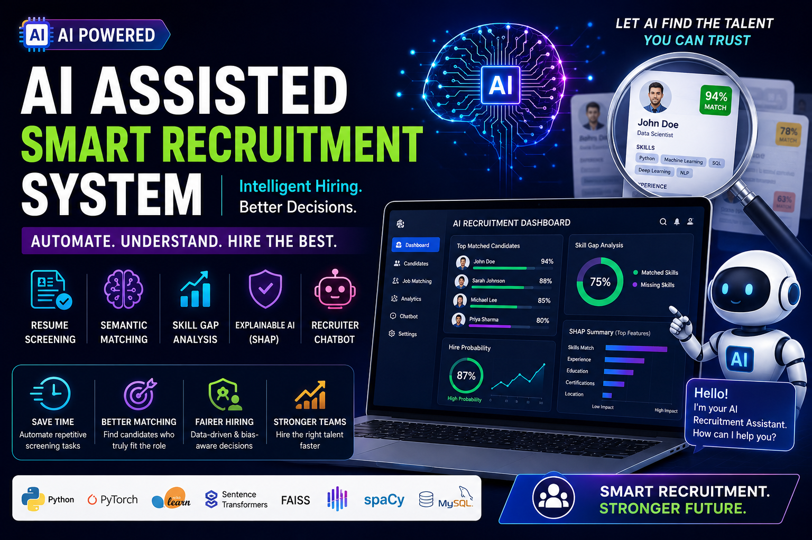
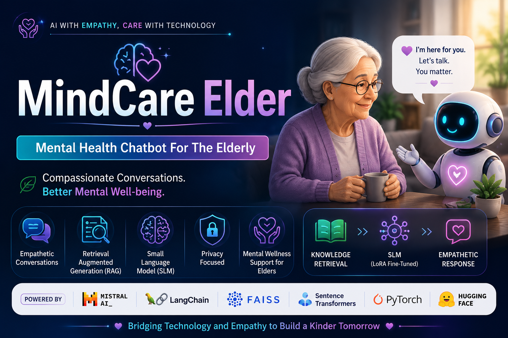
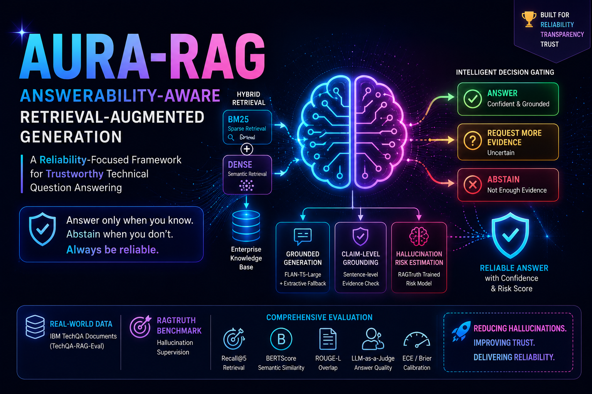
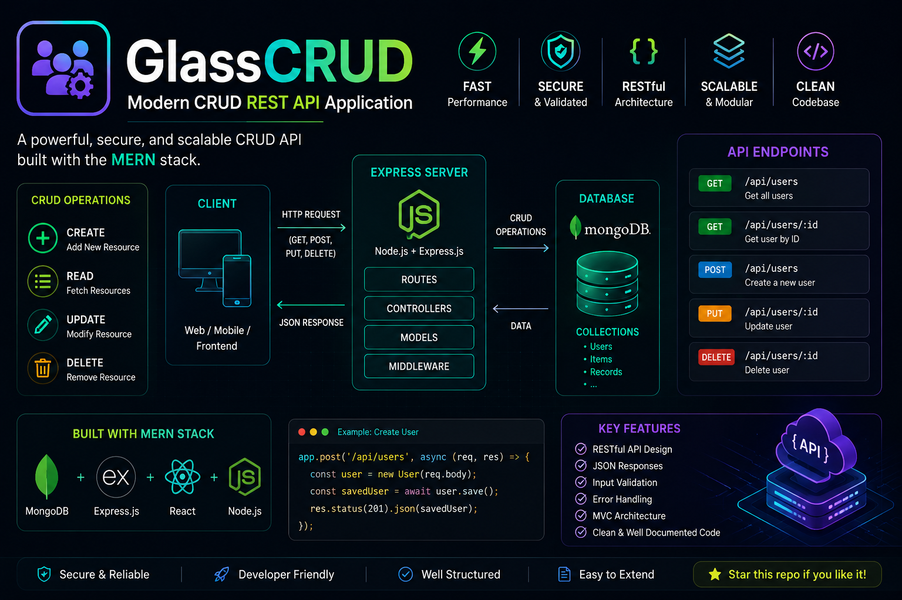

  
  
  
  
  
  

---

## 💫 About Me
 

🎓 &nbsp;**Final-year B.Tech** in **Computer Science & Technology @ JIS College of Engineering** **(CGPA: 8.5/10)**
 
💡 &nbsp;Passionate about building **AI-powered applications & modern web interfaces**
 
🤖 &nbsp;Deep interest in **LLMs, RAG Systems, Graph Neural Networks & NLP**
 
📄 &nbsp;**Published Researcher** — 1 paper at ICONFEST 2025 · 1 under review at **Elsevier**
 
🌱 &nbsp;Currently levelling up in **DSA, React JS & Advanced LLM Fine-Tuning**
 
🎯 &nbsp;Goal: Become a high-impact **AI Engineer / Software Developer**
 
💬 &nbsp;Ask me about **Machine Learning, Deep Learning, RAG, or Python!**
 
📧 &nbsp;Reach me at **lushichakraborty@gmail.com**
 
⚡ &nbsp;Fun fact: I love **dancing 💃, painting 🎨 & travelling ✈️** — & **turning ideas into real-world AI!**

   –  **"Thanks for visiting! Let's build something amazing together 🚀"** 
 

---

## 🚀 Featured Projects

<table>
<tr>

<td align="center" width="50%">

### 🤖 [AI-Assisted Smart Recruitment System](https://github.com/Kankana1012)
> *AI-Based Resume Screening & Candidate Recommendation*

</td>

<td align="center" width="50%">

### [Empathetic AI Mental Care Chatbot for Elderly](https://github.com/Kankana1012)
> *Mental Health Chatbot For The Elderly*

</td>
</tr>

<td align="center" width="50%">

###   🛡️ [RAG_Hallucination_Evaluation_System](https://github.com/Kankana1012)
> *AURA-RAG — AI That Knows When to Answer.*
</td>

<td align="center" width="50%">

### 🚀[GlassCRUD - Modern CRUD REST API Application](https://github.com/Kankana1012)
> *Building scalable CRUD APIs for modern applications.*
</td>
</tr>

<tr>
<td align="center" width="50%">

### 🚀[Project Name](https://github.com/Kankana1012)
> *Subtitle...*
</td>

<td align="center" width="50%">

### 🚀 More Projects

Explore my repositories for additional AI, Machine Learning, Deep Learning, and Backend Development projects.

</td>
</tr>
</table>

---

## 🛠️ Tech Stack & Skills

### 💻 Languages

### 🤖 AI / ML / DL

### 🌐 Web & Backend

### 🗄️ Databases & Tools

---

## 💼 Experience

<table>
<tr>
<td>🔬</td>
<td><strong>Research Intern — AI & ML</strong> <em>JIS College of Engineering (Under Dr. Sitanath Biswas)</em></td>
<td align="right"><code>Jan 2026 – Mar 2026</code></td>
</tr>
<tr><td colspan="3">→ 3-month intensive research on AI, ML & Deep Learning across 3 high-impact domains — Smart Recruitment, Elderly Mental Health AI, and RAG Hallucination Evaluation.</td></tr>

<tr><td colspan="3"> </td></tr>

<tr>
<td>🌩️</td>
<td><strong>Generative AI Intern</strong> <em>EduSkills (AWS Academy Virtual Internship)</em></td>
<td align="right"><code>Oct – Dec 2025</code></td>
</tr>
<tr><td colspan="3">→ 10-week program covering LLMs, AI pipelines, prompt engineering, and cloud-based AI services on AWS Academy curriculum.</td></tr>

<tr><td colspan="3"> </td></tr>

<tr>
<td>🌐</td>
<td><strong>Web Development Intern</strong> <em>Skill Dunia × Odcet Technologies</em></td>
<td align="right"><code>Aug – Oct 2025</code></td>
</tr>
<tr><td colspan="3">→ Built responsive web applications using HTML, CSS, and JavaScript; optimized for performance and usability.</td></tr>

<tr><td colspan="3"> </td></tr>

<tr>
<td>☕</td>
<td><strong>Java Full Stack Developer Intern</strong> <em>EduSkills (AICTE Virtual Internship)</em></td>
<td align="right"><code>Jul – Sep 2025</code></td>
</tr>
<tr><td colspan="3">→ End-to-end full stack development with Java (OOP, DB connectivity) and frontend technologies.</td></tr>

<tr><td colspan="3"> </td></tr>

<tr>
<td>🤖</td>
<td><strong>AI-ML Intern</strong> <em>EduSkills (Google for Developers – India Edu Program)</em></td>
<td align="right"><code>Apr – Jun 2025</code></td>
</tr>
<tr><td colspan="3">→ Applied supervised & unsupervised ML algorithms, data preprocessing, and model evaluation using Python.</td></tr>
</table>

---

## 📄 Publications

<table>
<tr>
<td>

📘 **An Explainable Deep Learning Framework for Intelligent Resume Screening**
> *Elsevier – Expert Systems with Applications* | Under Review (Mar 2026)

Proposes an attention-based deep learning model with semantic embeddings (SBERT) and SHAP for transparent, explainable candidate ranking in modern recruitment.

</td>
</tr>
<tr>
<td>

📗 **A Systematic Review of Technology-Assisted Recruitment Practices and Their Impact on Modern Hiring**
> *ICONFEST 2025 – JIS College of Engineering | Paper ID: 115 | CRC Press / IEEE Young Professionals* ✅ Published

Examines AI-driven recruitment tools, automation, and digital hiring platforms — evaluating efficiency, candidate experience, and hiring accuracy.

</td>
</tr>
</table>

---

## 🎓 Education

| Degree | Institution | Year | Score |
|---|---|---|---|
| 🎓 B.Tech — Computer Science & Technology | JIS College of Engineering, Kalyani | 2023 – Present | **CGPA: 8.5 / 10** |
| 🏛️ Diploma — Architecture | Women's Polytechnic, Chandernagore | 2019 – 2022 | **86.1%** |
| 📘 Intermediate (Class XII) | Gayeshpur Netaji Vidyamandir | 2018 – 2019 | 61.8% |
| 📗 Matriculation (Class X) | Bedibhawan Rabitritha Vidyalaya | 2016 – 2017 | 68% |

---

## 🏅 Certificates

| Certificate | Issuer | Year |
|---|---|---|
| 🌐 Full Stack Web Development | E-Cell IIT Hyderabad | 2025 |
| 🐍 Programming Fundamentals Using Python | Infosys | 2025 |
| 📊 Data Analytics Job Simulation | Deloitte (Forage) | 2025 |
| ☁️ Introduction to Internet of Things | NPTEL – IIT Kharagpur | 2025 |
| 🤖 Fundamentals of Artificial Intelligence | NPTEL – IIT Guwahati | 2024 |
| 🧮 Data Structures | Coursera | 2024 |
| 🏆 National Nritya Shree Award | International Dance & Music Festival | 2018 |

---

## 📊 GitHub Stats
 

---

## 🎯 Currently

- 🔭 Working on **AI-Assisted Smart Recruitment System** (ongoing research)
- 📖 Learning **Advanced DSA**, **React JS**, and **LLM fine-tuning**
- ✍️ Preparing paper submission to **Elsevier**
- 🎯 Goal: Land a high-impact role as an **AI Engineer / Software Developer**

---

## 🌸 Interests

💃 **Dancing** &nbsp;|&nbsp; 🎨 **Painting** &nbsp;|&nbsp; ✈️ **Traveling**

*"I love turning ideas into real-world impactful projects."*

---

**⭐ If you like my work, consider starring my repositories!**

*Made with ❤️ by Kankana Chakraborty*

